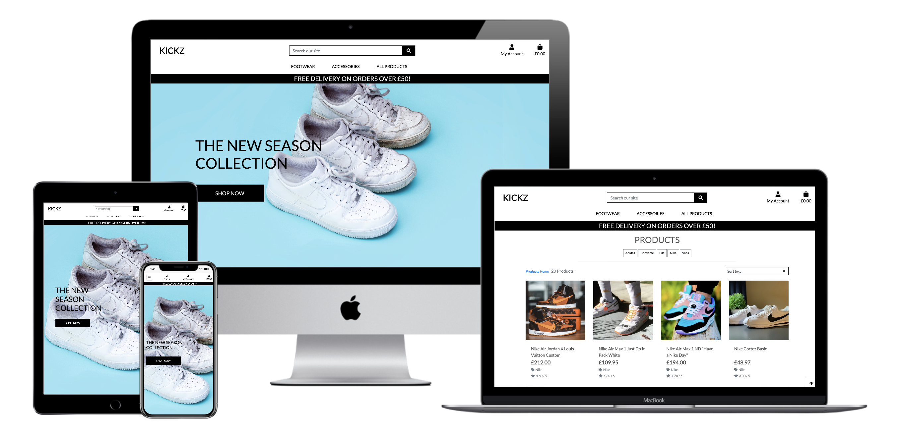

# 👟 KICKZ

**Code Institute - Full Stack Frameworks with Django Milestone Project**

A e-commerce store/website that combines front-end and back-end frameworks. Developed to provide high-quality footwear (trainers) and accessories, predominantly aimed at the Menswear fashion market.

Designed to be responsive and accessible on a range of devices, making it easy to navigate for potential users/customers. Creating an easy and informative based site. Whist striving for a minimalist and user-friendly design, to encourage a positive UX.

To test the website's checkout functionality, use the following payment credentials below:

- **Card number:** 4242 4242 4242 4242
- **Expiry date:** Any future date
- **CVC:** Any 3 digits
- **ZIP:** Any 5 digits

## Demo
A live demo can be found [here](https://kickzzz.herokuapp.com/).

<h2 align="center"></h2>

## Table of Contents

- <a href="#ux">User Experience</a>
- <a href="#features">Features</a>
- <a href="#information-architecture">Information Architecture</a>
- <a href="#technologies">Technologies Used</a>
- <a href="#testing">Testing</a>
- <a href="#deployment">Deployment</a>
- <a href="#credits">Credits</a>

<span id="ux"></span>

## User Experience (UX)

-   ### User stories

    -   #### Viewing and Navigation

        | Done | As a/an | I want to be able to ... | So that I can ...|
        | :----| :-------| :------------------------| :----------------|
        |&checkmark;| Shopper | View a list of products | Select some to purchase |
        |&checkmark;| Shopper | View a specific brand of products | Quickly find brands I'm interested in without having to search through all products |
        |&checkmark;| Shopper | View individual product details | Identify the price, description, product rating, product image and available sizes |
        |&checkmark;| Shopper | Easily view the total of my purchases at any time | Avoid spending too much money |

    -   #### Registration and User Accounts

        | Done | As a/an | I want to be able to ... | So that I can ...|
        | :----| :-------| :------------------------| :----------------|
        |&checkmark;| Site User | Easily register for an account | Have a personal account and be able to view my profile |
        |&checkmark;| Site User | Easily login or logout | Access my personal account information |
        |&checkmark;| Site User | Easily recover my password in case I forget it | Recover access to my account |
        |&checkmark;| Site User | Receive an email confirmation after registering | Verify that my account registration was successful |
        |&checkmark;| Site User | Have a personalised user profile | View my personal order history, order confirmations and save my payment information |
        
    -   #### Sorting and Searching

        | Done | As a/an | I want to be able to ... | So that I can ...|
        | :----| :-------| :------------------------| :----------------|
        |&checkmark;| Shopper | Sort the list of available products | Easily identify the best rated, best priced and branded sorted products |
        |&checkmark;| Shopper | Sort a specific brand of product | Find the best-priced or best-rated product in a specific brand or sort the products in that brand by name |
        |&checkmark;| Shopper | Search for a product by name or description | Find a specific product I'd like to purchase |
        |&checkmark;| Shopper | Easily see what I've searched for and the number of results | Quickly decide whether the product I want is available |

    -   #### Purchasing and Checkout

        | Done | As a/an | I want to be able to ... | So that I can ...|
        | :----| :-------| :------------------------| :----------------|
        |&checkmark;| Shopper | Easily select the size and quantity of a product when purchasing | Ensure I don't accidentally select the wrong product, quantity or size |
        |&checkmark;| Shopper | View items in my bag to be purchased | Identify the total cost of my purchase and all items I will receive |
        |&checkmark;| Shopper | Adjust the quantity of individual items in my bag | Easily make changes to my purchase before checkout |
        |&checkmark;| Shopper | Easily enter my payment information | Check out quickly and with no hassles |
        |&checkmark;| Shopper | Feel my personal and payment information is safe and secure | Confidently provide the required information to make a purchase |
        |&checkmark;| Shopper | View an order confirmation after checkout | Verify that I haven't made any mistakes with my order |
        |&checkmark;| Shopper | Receive an email confirmation after checking out | Keep the confirmation of what I've purchased for my records |

    -   #### Admin and Store Management

        | Done | As a/an | I want to be able to ... | So that I can ...|
        | :----| :-------| :------------------------| :----------------|
        |&checkmark;| Store Owner | Add a product | Add new items to my store |
        |&checkmark;| Store Owner | Edit/update a product | Change product prices, descriptions, images and other product criteria |
        |&checkmark;| Store Owner | Delete a product | Remove items that are no longer for sale |

*   ### Design
    -   #### Colour Scheme
        -   The three main colours used are black, davys grey and white. Keeping the classic colour scheme simple, yet effective.
        
	

    -   #### Typography
        -   I opted to use Google's font Lato, due to it’s clean font style, which fitted in with the aesthetic I wanted for the website.
    -   #### Imagery
        -   A strong hero image was used on the home page, to catch the user’s attention. Powerful imagery helps to engage the user and engage them into interaction with the website.

*   ### Wireframes

    -   Desktop Wireframes - [View](https://github.com/anronuay/MS4-kickz/blob/master/wireframes/desktop-wireframes.pdf)
    
    -   Tablet Wireframes - [View](https://github.com/anronuay/MS4-kickz/blob/master/wireframes/tablet-wireframes.pdf)
    			
    -   Mobile Wireframes - [View](https://github.com/anronuay/MS4-kickz/blob/master/wireframes/smartphone-wireframes.pdf)
    
<div align="right">
    <a href="#table-of-contents"> ⇧ Back To Top </a>
</div>

<span id="features"></span>

## Features

### Existing Features

-   Fully functioning e-commerce store.
-   Responsive on all device sizes.
-   Interactive elements.
-   Register a profile/account, Log In & Log Out functionality.
-   Create, Read, Update and Delete functionality, within the website database, for Superusers (Admin).
-   All users can shop/make purchases, after the register/log in process, to view their profile and order history.
-   All guest users can shop/make purchases, without having to go through the register/log in process. Guest users will be unable to view their profile and order history.
-   Admin only privileges, for Superusers to manage products section/page.
-   Feedback system that reports successful and unsuccessful purchases to the user, with helpful pop-up messages.
-   Security features to protect the website/store, to prevent malicious intent.
- Stripe payment functionality.
- Email integration, for user confirmations, for registration/password reset/order confirmation etc.

### Future Features

-   Allow users to add items to shopping bag from product page, with an additional button. Instead of clicking through to the product's description page only.
-   Implement Apple pay, Paypal and two-factor authentication.
-   Integrate social media and google sign in functionality, making it more accessible for the user. Additionally allow admin to track user's activity more efficiently. By using data analytics for targeted email marketing and advertising. To encourage business growth.
-   Provide a contact form/page or/and chat feature function, to allow users to contact admin with any enquiries/issues.
-   Apply some defensive programming, to confirm if Superuser (Admin), wants to delete an item or not. To prevent accidental deleted entries, in product management.
-   To enable a potential real store e-commerce site, requires the following: additional testing on Stripe, setting up real confirmation emails, switching the Stripe settings to use the live keys, rather then the test ones used currently, further tests for application checkout and shopping bag apps, additional security adjustments, as well as some minor changes to make it easier to navigate between the development and production environments.

<div align="right">
    <a href="#table-of-contents"> ⇧ Back To Top </a>
</div>

<span id="information-architecture"></span>

## Information Architecture

### Database

- During development in Gitpod I worked with the standard SQLite3 database which comes installed with Django.

- On deployment, the SQL database installed in Heroku is a PostgreSQL database.

### Database Models

All models were created with Django's ability to auto-assign a Primary Key (ID). 

#### User Model

The User model used for this project is the standard one provided by Django.

#### Brand Model

| Name | Key in db | Validation | Field Type |
--- | --- | --- | ---
Name | name | max_length=250 | CharField
Friendly Name | friendly_name | max_length=250, null=True, blank=True | CharField

#### Product Model

| Name | Key in db | Validation | Field Type |
--- | --- | --- | ---
Brand | brand | null=True, blank=True, on_delete=models.SET_NULL | ForeignKey to Brand
SKU | sku | max_length=254, null=True, blank=True | CharField
Name | name | max_length=254 | CharField
Description | description | blank | TextField
Has Sizes | has_sizes | blank | BooleanField
Price | price | max_digits=6, decimal_places=2 | DecimalField
Rating | rating | max_digits=6, decimal_places=2, null=True, blank=True | DecimalField
Image | image | null=True, blank=True | ImageField

#### Order Model

| Name | Key in db | Validation | Field Type |
--- | --- | --- | ---
Order Number | order_number | max_length=32, null=False, editable=False | CharField
User Profile | user_profile | on_delete=models.SET_NULL, null=True, blank=True, related_name='orders' | ForeignKey to User
Full Name | full_name | max_length=50, null=False, blank=False | CharField
Email | email | max_length=254, null=False, blank=False | EmailField
Phone Number | phone_number | max_length=20, null=False, blank=False | CharField
Postcode | postcode | max_length=20, null=True, blank=True | CharField
Town / City / Locality | town_or_city | max_length=40, null=False, blank=False | CharField
Street Address 1 | street_address1 | max_length=80, null=False, blank=False | CharField
Street Address 2 | street_address1 | max_length=80, null=False, blank=False | CharField
County | county | max_length=80, null=True, blank=True | CharField
Country | country | max_length=80, null=True, blank=True | CharField
Date | date | auto_now_add=True | DateTimeField
Delivery Cost | delivery_cost | max_digits=6, decimal_places=2, null=False, default=0 | DecimalField
Order Total | order_total | max_digits=10, decimal_places=2, null=False, default=0 | DecimalField
Grand Total | grand_total | max_digits=10, decimal_places=2, null=False, default=0 | DecimalField
Shopping Cart | original_cart | null=False, blank=False, default='' | TextField
Stripe PID | stripe_pid | max_length=254, null=False, blank=False, default='' | CharField

#### Order Item Model

| Name | Key in db | Validation | Field Type |
--- | --- | --- | ---
Order | order | on_delete=models.CASCADE | ForeignKey to Order
Product | product | on_delete=models.PROTECT | ForeignKey to Product
Product size | product_size | max_length=2, null=True, blank=True | CharField
Quantity | quantity | null=False, blank=False, default=0 | IntegerField
Line Item Total | lineitem_total | max_digits=6, decimal_places=2, null=False, blank=False, editable=False | DecimalField

<div align="right">
    <a href="#table-of-contents"> ⇧ Back To Top </a>
</div>

<span id="technologies"></span>

## Technologies Used

### Languages Used

-   [HTML5](https://en.wikipedia.org/wiki/HTML5)
-   [CSS3](https://en.wikipedia.org/wiki/Cascading_Style_Sheets)
-   [JavaScript](https://en.wikipedia.org/wiki/JavaScript)
-   [Python](https://en.wikipedia.org/wiki/Python_(programming_language))

### Frameworks, Libraries & Programs Used

1. [Bootstrap 4.5.3:](https://getbootstrap.com/docs/4.5/getting-started/introduction/)
    - Bootstrap was used to assist with the responsiveness and styling of the website.
1. [Django 3.1.6:](https://www.djangoproject.com/start/)
    - Django is a high-level Python Web framework that encourages rapid development and clean, pragmatic design.
1. [Stripe:](https://stripe.com/gb)
    - Stripe provides APIs that web developers can use to integrate payment processing into their websites and mobile applications.
1. [AWS:](https://aws.amazon.com/)
    - Amazon Web Services is a subsidiary of Amazon providing on-demand cloud computing platforms and APIs.
1. [Font Awesome:](https://fontawesome.com/)
    - Font Awesome was used throughout the website to add icons for aesthetic and UX purposes.
1. [Google Fonts:](https://fonts.google.com/)
    - Making the web more beautiful, fast, and open through great typography.
1. [jQuery:](https://jquery.com/)
    - jQuery - JavaScript library.
1. [Django Allauth:](https://django-allauth.readthedocs.io/en/latest/installation.html)
    - Integrated set of Django applications addressing authentication, registration, account management as well as 3rd party (social) account authentication.
1. [Django-crispy-forms:](https://django-crispy-forms.readthedocs.io/en/latest/install.html)
    - Django-crispy-forms is an application that helps to manage Django forms. It allows adjusting forms' properties (such as method, send button or CSS classes) on the backend without having to re-write them in the template.
1. [Pillow:](https://pillow.readthedocs.io/en/stable/)
    - Python Imaging Library that adds support for opening, manipulating, and saving many different image file formats.
1. [Gunicorn:](https://gunicorn.org/)
    - The Gunicorn "Green Unicorn" is a Python Web Server Gateway Interface HTTP server.
1. [Jinja:](https://jinja.palletsprojects.com/en/2.11.x/)
    - Jinja is a modern and designer-friendly templating language for Python, modelled after Django’s templates.
1. [SQLite3:](https://www.sqlite.org/index.html)
    - Database used in development, automatically included with Django.
1. [PostgreSQL:](https://www.postgresql.org/)
    - Database used in production, installed to Heroku.
1. [Black:](https://black.readthedocs.io/en/stable/installation_and_usage.html)
    - Black is the uncompromising Python code formatter.
1. [Psycopg2-binary:](https://pypi.org/project/psycopg2-binary/)
    - Used to allow PostgresSQL to be used with Python.
1. [Boto3:](https://boto3.amazonaws.com/v1/documentation/api/latest/index.html)
    - Aid the deployment of AWS S3.
1. [Heroku:](https://www.heroku.com/)
    - Heroku is a cloud platform as a service supporting several programming languages. 
1. [Git](https://git-scm.com/)
    - Git was used for version control by utilising the Gitpod terminal to commit to Git and Push to GitHub.
1. [GitHub:](https://github.com/)
    - GitHub is used to store the projects code after being pushed from Git.
1. [Balsamiq:](https://balsamiq.com/)
    - Balsamiq was used to create the [wireframes](https://github.com/anronuay/MS4-kickz/tree/master/wireframes) during the design process.
1. [WebAIM:](https://webaim.org/resources/contrastchecker/)
    - Contrast checker, relevant in terms of accessibility and UX design.
1. [Unsplash:](https://unsplash.com/)
    - Beautiful, free images and photos that you can download and use for any project. Better than any royalty free or stock photos.
1. [PicResize:](https://picresize.com/)
    - Free original picture editing tool on the Internet. Used to help resize all the map info window images.
1. [Favicon.io:](https://favicon.io/)
    - Free shortcut icon, website icon, tab icon, URL icon, or bookmark icon, associated with a particular website or web page.
1. [Multi Device Website Mockup Generator:](https://techsini.com/multi-mockup/)
    - Multi device website mockup generator is a free online tool to test your responsive website on apple devices including Apple iMac, MacBook, iPad and iPhone.
1. [Coolors:](https://coolors.co/)
    - Generate or browse beautiful colour combinations for your designs.
1. [Temp Mail:](https://temp-mail.org/en/)
    - Disposable email - is a service that allows to receive email at a temporary address that self-destructed after a certain time elapses.
1. [Lighthouse:](https://developers.google.com/web/tools/lighthouse#devtools)
    - Lighthouse is an open-source, automated tool for improving the quality of web pages.
1. [Lucidchart:](https://www.lucidchart.com/pages/)
    - Lucidchart is a web-based proprietary platform that allows users to collaborate on drawing, revising and sharing charts and diagrams.

<div align="right">
    <a href="#table-of-contents"> ⇧ Back To Top </a>
</div>

<span id="testing"></span>

## Testing

The W3C Markup Validator and W3C CSS Validator Services were used to validate every page of the project to ensure there were no syntax errors in the project. Along with JS Hint to ensure there were no linting issues with my JavaScript and PEP 8 compliant Python code.

-   [W3C Markup Validator](https://validator.w3.org/#validate_by_input) - Only errors received, were relating to the Jinja syntax.
-   [W3C CSS Validator](https://jigsaw.w3.org/css-validator/#validate_by_input) - [Results](https://github.com/anronuay/MS4-kickz/blob/master/readme-docs/w3c-css.validator.png)
-   [JS Hint Version 2.12.0](https://jshint.com/)
-   [PEP8 online](http://pep8online.com/) - Used Black to format my Python code, to ensure as much of the code is PEP8 compliant. Any remaining issues were left unresolved to ensure the app would remain functioning.

### Testing User Stories from User Experience (UX) Section

-   ### User stories

    -   #### Viewing and Navigation

        | Done | As a/an | I want to be able to ... | Testing result |
        | :----| :-------| :------------------------| :--------------|
        |&checkmark;| Shopper | View a list of products | Navbar & search bar |
        |&checkmark;| Shopper | View a specific brand of products | Search function & brands listed individually |
        |&checkmark;| Shopper | View individual product details | Product description page, with additional information |
        |&checkmark;| Shopper | Easily view the total of my purchases at any time | Responsive pop-up messages throughout & shopping bag/basket with current total in navbar |

    -   #### Registration and User Accounts

        | Done | As a/an | I want to be able to ... | Testing result |
        | :----| :-------| :------------------------| :--------------|
        |&checkmark;| Site User | Easily register for an account | Register functionality |
        |&checkmark;| Site User | Easily login or logout | Login functionality |
        |&checkmark;| Site User | Easily recover my password in case I forget it | Forgot password prompt to reset user password |
        |&checkmark;| Site User | Receive an email confirmation after registering | Verify user to their account & website |
        |&checkmark;| Site User | Have a personalised user profile | Account users are able to save their information & see their order history |
        
    -   #### Sorting and Searching

        | Done | As a/an | I want to be able to ... | Testing result |
        | :----| :-------| :------------------------| :--------------|
        |&checkmark;| Shopper | Sort the list of available products | Easily list products by rating, price and brand name |
        |&checkmark;| Shopper | Sort a specific brand of product | View best-priced or best-rated product in a specific brand or sort the products in that brand by name |
        |&checkmark;| Shopper | Search for a product by name or description | Search bar enables key words to be searched through the database/website |
        |&checkmark;| Shopper | Easily see what I've searched for and the number of results | Quickly decide what products are available and fit your criteria |

    -   #### Purchasing and Checkout

        | Done | As a/an | I want to be able to ... | Testing result |
        | :----| :-------| :------------------------| :--------------|
        |&checkmark;| Shopper | Easily select the size and quantity of a product when purchasing | Large call to action buttons and responsive interface to allow for a positive UX |
        |&checkmark;| Shopper | View items in my bag to be purchased | Confirmation of order in shopping bag before checkout page and entering payment details |
        |&checkmark;| Shopper | Adjust the quantity of individual items in my bag | Easily make amendments to your order in the shopping bag before purchasing |
        |&checkmark;| Shopper | Easily enter my payment information | Clear and concise checkout/payment page to aid a smooth transaction |
        |&checkmark;| Shopper | Feel my personal and payment information is safe and secure | Security measures in place to provide user protection, whilst using the website |
        |&checkmark;| Shopper | View an order confirmation after checkout | Confirmation page to confirm details of transaction/purchase |
        |&checkmark;| Shopper | Receive an email confirmation after checking out | Confirmation email receipt provided for the user's records, of said purchase/order made |

    -   #### Admin and Store Management

        | Done | As a/an | I want to be able to ... | Testing result |
        | :----| :-------| :------------------------| :----------------|
        |&checkmark;| Store Owner | Add a product | Add new products/items to the website, via product management page |
        |&checkmark;| Store Owner | Edit/update a product | Amend/update product prices, descriptions, images and other product criteria |
        |&checkmark;| Store Owner | Delete a product | Remove products/items that are no longer for sale |

### Further Testing

-   The Website was tested on Google Chrome, Internet Explorer, Microsoft Edge and Safari browsers.
-   The website was viewed on a variety of devices such as Desktop, Laptop, iPad, iPhone 5SE, iPhone7, iPhone 8, Samsung Galaxy S10 and all mobile device options provided by Google Chrome DevTools.
-   A large amount of testing was done to ensure that all pages were linking correctly.
-   Friends and family members were asked to review the site and documentation to point out any bugs and/or user experience issues.

### Automated Testing

I used Lighthouse on Google Chrome DevTools to test the performance of my website and made the necessary adjustments to maximise performance results.

1. Desktop: [Results](https://github.com/anronuay/MS4-kickz/blob/master/readme-docs/chrome.lighthouse-desktop.png)

2. Mobile: [Results](https://github.com/anronuay/MS4-kickz/blob/master/readme-docs/chrome.lighthouse-mobile.png)

### Manual Testing

Using the Bootstrap layout and mobile first development method, it allowed me to create a responsive website. All of the content resizes appropriately within the size of the displayed screen. This was tested using Google Chrome DevTools, allowing me to use the responsive feature and set mobile devices, to resize the screen and see how the website responded to different device screen sizes. 

1. Home: [View](https://github.com/anronuay/MS4-kickz/blob/master/readme-docs/website.screenshot-home.png)
    1. Search bar enables the user to search through all website products, using key words. Leads to products results page.
    2. Responsive navbar, with call to action buttons/links. Including home/landing page, my account (register & login) and shopping bag.
    3. Three drop down menu categories, includes brands, accessories and all products (by price, rating and brand).
    4. Large call to action button, with the slogan 'shop now' to entice the user to browse the website. Takes the user to the all products page.
    5. Flash messages to allow user responsive feedback from action.
    6. No console errors detected.

2. Log In/Register: [View: Log In](https://github.com/anronuay/MS4-kickz/blob/master/readme-docs/website.screenshot-login.png) [View: Register](https://github.com/anronuay/MS4-kickz/blob/master/readme-docs/website.screenshot-register.png)
    1. Search bar enables the user to search through all website products, using key words. Leads to products results page.
    2. Responsive navbar, with call to action buttons/links. Including home/landing page, my account (register & login) and shopping bag.
    3. Three drop down menu categories, includes brands, accessories and all products (by price, rating and brand).
    4. Prompt for user to enter, email, username and password, to log in and/or register.
    5. All fields will expect characters with min & max length, including combinations of either/or letters and numbers.
    6. The user must meet these requirements or a prompt will instruct them to match the correct format.
    7. Additional link provided, to either register or log in, or vice versa, to allow the user ease of navigation.
    8. Forgot password link for users to reset their password. Prompting the user to enter their email, for a password reset email link, to change their password. [View: Reset](https://github.com/anronuay/MS4-kickz/blob/master/readme-docs/website.screenshot-passwordreset.png) [View: Change](https://github.com/anronuay/MS4-kickz/blob/master/readme-docs/website.screenshot-passwordchange.png)
    9. Flash messages to allow user responsive feedback from action.
    10. No console errors detected.
    
3. Products: [View](https://github.com/anronuay/MS4-kickz/blob/master/readme-docs/website.screenshot-products.png)
    1. Search bar enables the user to search through all website products, using key words. Leads to products results page.
    2. Responsive navbar, with call to action buttons/links. Including home/landing page, my account (register & login) and shopping bag.
    3. Three drop down menu categories, includes brands, accessories and all products (by price, rating and brand).
    4. Product images, includes product name, price, brand name and rating.
    5. Dropdown menu has further sorting and searching, by price, rating, name and brand.
    6. Scroll back to top button/feature.
    7. Flash messages to allow user responsive feedback from action.
    8. No console errors detected.

4. Product Description: [View](https://github.com/anronuay/MS4-kickz/blob/master/readme-docs/website.screenshot-description.png)
    1. Search bar enables the user to search through all website products, using key words. Leads to products results page.
    2. Responsive navbar, with call to action buttons/links. Including home/landing page, my account (register & login) and shopping bag.
    3. Three drop down menu categories, includes brands, accessories and all products (by price, rating and brand).
    4. Product image (allows users to click on the image and open up in a new tab), includes product name, price, brand name, rating and description. Drop down menu for products that have different sizes available and quantity selector. With call to action buttons, 'keep shopping' or 'add to bag'.
    5. Flash messages to allow user responsive feedback from action.
    6. No console errors detected.
  
5. Shopping Bag: [View](https://github.com/anronuay/MS4-kickz/blob/master/readme-docs/website.screenshot-shoppingbag.png)
    1. Search bar enables the user to search through all website products, using key words. Leads to products results page.
    2. Responsive navbar, with call to action buttons/links. Including home/landing page, my account (register & login) and shopping bag.
    3. Three drop down menu categories, includes brands, accessories and all products (by price, rating and brand).
    4. Product info page, includes product name, sku and price. With additional cost breakdown of shopping bag, subtotal, bag total, delivery and grand total.
    5. Quantity selector, to amended products in bag. With call to action buttons, 'keep shopping' or 'secure checkout'.
    6. Flash messages to allow user responsive feedback from action.
    7. No console errors detected.
    
6. Checkout: [View](https://github.com/anronuay/MS4-kickz/blob/master/readme-docs/website.screenshot-checkout.png)
    1. Search bar enables the user to search through all website products, using key words. Leads to products results page.
    2. Responsive navbar, with call to action buttons/links. Including home/landing page, my account (register & login) and shopping bag.
    3. Three drop down menu categories, includes brands, accessories and all products (by price, rating and brand).
    4. Order summary page, includes product name, size (if relevant) and quantity. With additional cost breakdown of shopping bag, subtotal, order total, delivery and grand total.
    5. Checkout order form, includes name, email, delivery address and Stripe payment details (with final red card charge warning, prior to processed payment).
    6. Prompts user to either register or login to their account before checkout is completed. With call to action buttons, 'adjust bag' or 'complete order'.
    7. Flash messages to allow user responsive feedback from action.
    8. No console errors detected.

7. Checkout Processed: [View](https://github.com/anronuay/MS4-kickz/blob/master/readme-docs/website.screenshot-checkoutprocessed.png)
    1. Search bar enables the user to search through all website products, using key words. Leads to products results page.
    2. Responsive navbar, with call to action buttons/links. Including home/landing page, my account (register & login) and shopping bag.
    3. Three drop down menu categories, includes brands, accessories and all products (by price, rating and brand).
    4. Order confirmation page, includes all order info, order details, delivery address and billing info.
    5. Confirmation email is also sent to the email address provided upon purchase or/and linked to the user's profile account.
    6. Prompts user with call to action button, 'now check out the latest deals!'.
    7. Flash messages to allow user responsive feedback from action.
    8. No console errors detected.

8. My Profile: [View](https://github.com/anronuay/MS4-kickz/blob/master/readme-docs/website.screenshot-myprofile.png)
    1. Search bar enables the user to search through all website products, using key words. Leads to products results page.
    2. Responsive navbar, with call to action buttons/links. Including home/landing page, my account (register & login) and shopping bag.
    3. Three drop down menu categories, includes brands, accessories and all products (by price, rating and brand).
    4. Profile page for logged in users, includes delivery info (with the option to have it saved to your profile/account) and previous order history. With links to previous past transactions and order info.
    5. Prompts user with call to action button, 'update information'.
    6. Flash messages to allow user responsive feedback from action.
    7. No console errors detected.

9. Sign Out: [View](https://github.com/anronuay/MS4-kickz/blob/master/readme-docs/website.screenshot-signout.png)
    1. Search bar enables the user to search through all website products, using key words. Leads to products results page.
    2. Responsive navbar, with call to action buttons/links. Including home/landing page, my account (register & login) and shopping bag.
    3. Three drop down menu categories, includes brands, accessories and all products (by price, rating and brand).
    4. Sign out page, reminds the user again if they would like to sign out of their account.
    5. Prompts user with call to action buttons, 'cancel' and 'sign out'.
    6. Flash messages to allow user responsive feedback from action.
    8. No console errors detected.

10. Product Management (Admin): [View](https://github.com/anronuay/MS4-kickz/blob/master/readme-docs/website.screenshot-productmanagement.png)
    1. Search bar enables the user to search through all website products, using key words. Leads to products results page.
    2. Responsive navbar, with call to action buttons/links. Including home/landing page, my account (register & login) and shopping bag.
    3. Three drop down menu categories, includes brands, accessories and all products (by price, rating and brand).
    4. Add product page, permissions only available to Superusers (Admin), for CRUD functionality. Includes all details, brand, sku, product name, description, has sizes (drop down menu), price, rating and select image.
    6. Prompts Superuser with call to action buttons, 'cancel' and 'add product'.
    7. Flash messages to allow user responsive feedback from action.
    8. No console errors detected.

11. Emails:
    1. Order confirmation [View](https://github.com/anronuay/MS4-kickz/blob/master/readme-docs/confirmation-order.png)
    2. Confirmation email [View](https://github.com/anronuay/MS4-kickz/blob/master/readme-docs/confirm-email.png.png)
    3. Password reset email [View](https://github.com/anronuay/MS4-kickz/blob/master/readme-docs/password-reset-email.png)
   
### Known Bugs

- On small mobile devices, such as the Galaxy Fold. There are issues with the delivery banner, buttons and navbar, wrapping elements and losing their positioning. Creating a more cluttered look to the UX. Given more time, this would be something I would rectify, to keep within the design aesthetic for the rest of the website.

- On small or/and older models of ipads, the home tab link is absent on the collapsed navbar. However it is present on mobile and newer/larger ipad pro devices. Again with more time, this would be another issue I would rectify.

- The sign in check box, to 'remember me' for users on the sign in page, currently does not work as intended. Again with more time, I would resolve this issue, as it would be a useful feature for users to have.

- On the majority of mobile devices, on the shopping bag page, with a product/item in the basket. The quantity tabs, more specifically the 'remove' link (on the right hand side), is obstructed slightly by the scroll back to top button/feature, at the bottom right of the page.

- With the Superuser logged in and on the product management page. If quantities of a product/item are added in to the basket and then said product/item is deleted from the website/database, before deleting it from the user's basket. It throws an error, with a 'not found' page displayed. I have found going in to Chrome DevTools, inspect, application, cookies and deleting the session id, seems to restart and reload the page again. With sufficient time, this issue would be resolved before going live.

<div align="right">
    <a href="#table-of-contents"> ⇧ Back To Top </a>
</div>

<span id="deployment"></span>

## Deployment

### Heroku Deployment with AWS

This project uses **Heroku** for deployment, following these steps:

1. Install these packages to your local environment, since these packages are required to deploy a Django project on Heroku.
- [gnicorn](https://gunicorn.org/): `gnicorn` is Python WSGI(web server gataway interface) server for UNIX.
- [gninx](https://www.nginx.com/): `gninx` is a free, open-source, high-performance HTTP server and reverse proxy, as well as an IMAP/POP3 proxy server.
- [psycopg2-binary](https://pypi.org/project/psycopg2-binary/): `psycopg2-binary` is PostgreSQL database adapter for the Python programming language.
- [dj-database-url](https://pypi.org/project/dj-database-url/): `dj-database-url` allows you to utilise the 12factor inspired DATABASE_URL environment variable to configure your Django application.
2. Create a `requirements.txt` file and freeze all the modules with the command `pip3 freeze > requirements.txt` in the terminal.
3. Create a `Procfile` write `web: gunicorn kickz.wsgi:application` in the file.
4. `git add` and `git commit` and `git push` all the changes to the Github repository of this project.
5. Go to Heroku and create a **new app**. Set a name for this app and select the closest region (Europe) and click **Create app**.
6. Go to **Resources** tab in Heroku, then in the **Add-ons** search bar look for **Heorku Postgres**(you can type postgres), select **Hobby Dev — Free** and click **Submit Order Form** button to add it to your project.
7. In the heroku dashboard for the application, click on **Setting** > **Reveal Config Vars** and set the values as follows:

| Key | Value |
| ----------- | ----------- |
| AWS_ACCESS_KEY_ID | `Your AWS Access Key` |
| AWS_SECRET_ACCESS_KEY | `Your AWS Secret Access Key` |
| DATABASE_URL | `Your Postgres Database URL` |
| EMAIL_HOST_PASS | `Your Email Password (generated by Gmail)` |
| EMAIL_HOST_USER | `Your Email Address` |
| SECRET_KEY | `Your Secret Key` |
| STRIPE_PUBLIC_KEY | `Your Stripe Public Key` |
| STRIPE_SECRET_KEY | `Your Stripe Secret Key` | 
| STRIPE_WH_SECRET | `Your Stripe WH Key` |
| USE_AWS | `True` |

* I used [MiniWebtool](https://miniwebtool.com/django-secret-key-generator/) to generate a Django Secret Key, for this project.

8. Comment out the current database setting in settings.py, and add the code below instead. This is done temporarily to migrate the database on Heroku.
```
  DATABASES = {     
        'default': dj_database_url.parse("<your Postgres database URL here>")     
    }
```
9. Migrate the database models to the Postgres database using the following commands in the terminal:
`python3 manage.py migrate`
10. Load the data fixtures into the Postgres database using the following command:
`python3 manage.py loaddata <fixture_name>`
11. Create a Superuser for the Postgres database by running the following command:
`python3 manage.py createsuperuser`
12. Replace the database setting with the code below, so that the right database is used depending on development/deployed environment.
```
if 'DATABASE_URL' in os.environ:
    DATABASES = {
        'default': dj_database_url.parse(os.environ.get('DATABASE_URL'))
    }
else:
    DATABASES = {
        'default': {
            'ENGINE': 'django.db.backends.sqlite3',
            'NAME': os.path.join(BASE_DIR, 'db.sqlite3'),
        }
    }
```
13. Disable collect static, so that Heroku won't try to collect static file with: `heroku config:set DISABLE_COLLECTSTATIC=1`
14. Add `'kickzzz.herokuapp.com', 'localhost' to `ALLOWED_HOSTS` in settings.py.
```
ALLOWED_HOSTS = ['kickzzz.herokuapp.com', 'localhost']
```
15. In Stripe, add Heroku app URL a new webhook endpoint.
16. Update the settings.py with the new Stripe environment variables and email settings.
17. Commit all the changes to Heroku. Media files are not connected to the app yet but the app should be working on Heroku.

### Amazon Web Service S3
The static files and media files for this deployed site, are hosted in the [AWS](https://aws.amazon.com/) S3 Bucket. You will need to create S3 bucket, complete the setting up and upload static files and media files to the S3 bucket. You can find [Amazon S3 documentation](https://docs.aws.amazon.com/AmazonS3/latest/gsg/CreatingABucket.html) for more information on the setting.
I used CORS configuration below:
```
[
  {
      "AllowedHeaders": [
          "Authorization"
      ],
      "AllowedMethods": [
          "GET"
      ],
      "AllowedOrigins": [
          "*"
      ],
      "ExposeHeaders": []
  }
]
```

- Setting for static/media files in settings.py
1. Install `boto3` and `django-storages` with a command `pip3 install boto3` and `pip3 install django-storages` in your terminal, to connect AWS S3 bucket to Django.
2. Add 'storages' to `INSTALLED_APPS` in settings.py.
3. Add the following in settings.py.
```
if 'USE_AWS' in os.environ:
    # Cache Control
    AWS_S3_OBJECT_PARAMETERS = {
        'Expires': 'Thu, 31 Dec 2099 20:00:00 GMT',
        'CacheControl': 'max-age=94608000',
    }

    # Bucket Config
    AWS_STORAGE_BUCKET_NAME = 'kickzzz'
    AWS_S3_REGION_NAME = 'eu-west-2'
    AWS_ACCESS_KEY_ID = os.getenv('AWS_ACCESS_KEY_ID')
    AWS_SECRET_ACCESS_KEY = os.getenv('AWS_SECRET_ACCESS_KEY')
    AWS_S3_CUSTOM_DOMAIN = f'{AWS_STORAGE_BUCKET_NAME}.s3.amazonaws.com'

    # Static and media files
    STATICFILES_STORAGE = 'custom_storages.StaticStorage'
    STATICFILES_LOCATION = 'static'
    DEFAULT_FILE_STORAGE = 'custom_storages.MediaStorage'
    MEDIAFILES_LOCATION = 'media'

    # Override static and media URLs in production
    STATIC_URL = f'https://{AWS_S3_CUSTOM_DOMAIN}/{STATICFILES_LOCATION}/'
    MEDIA_URL = f'https://{AWS_S3_CUSTOM_DOMAIN}/{MEDIAFILES_LOCATION}/'
```
5. Add [custom_storages.py](https://github.com/anronuay/MS4-kickz/blob/master/custom_storages.py).
6. Delete DISABLE_COLLECTSTATIC from Heroku Config Var.
7. Push all the changes to Github/Heroku and all the static files will be uploaded to S3 bucket.
By setting up above, Heroku will run python3 manage.py collectstatic during the build process and look for static and media files.

### Automatic Deploy on Heroku
You can enable automatic deploy in the following steps that pushes update to Heroku every time you push to github.
1. Go to Deploy in Heroku dashboard.
2. At `Automatic deploys`, choose a github repository you want to deploy.
3. Click `Enable Automatic Deploys`.


## Local Deployment
For local deployment, you need to have an IDE (I used Gitpod for this project) and you need to install the following:
- Git, Python3, PIP3
Also, you need to create account in the following services if you don't own yet:
- Stripe, AWS (S3 bucket) and Gmail email.

1. In the IDE you are using, copy and paste the following command into the terminal to clone this repository.
    `git clone https://github.com/anronuay/MS4-kickz.git`
(the other ways to clone a repository are written in this [GitHub documentation](https://docs.github.com/en/free-pro-team@latest/github/creating-cloning-and-archiving-repositories/cloning-a-repository))
2. Set up environment variable in your selected IDE, or you can create `.env` file in your root directory and add `.env` to `.gitignore` file, and add the following to the `.env` file.
```
import os  
os.environ["DEVELOPMENT"] = "True"    
os.environ["SECRET_KEY"] = "<Your Secret Key>"
os.environ["STRIPE_PUBLIC_KEY"] = "<Your Stripe Public Key>"    
os.environ["STRIPE_SECRET_KEY"] = "<Your Stripe Secret Key>"    
os.environ["STRIPE_WH_SECRET"] = "<Your Stripe WH Secret Key>"    
```
3. Install all the required packages with `pip3 install -r requirements.txt`
4. Migrate the models to create a database using in your IDE with `python3 manage.py makemigrations` and `python3 manage.py migrate`
5. Load the data fixtures in to the database using the following command:
`python3 manage.py loaddata <fixture_name>`
6. Create a superuser for the Postgres database by running with `python3 manage.py createsuperuser`
7. Now you can access the app using the command `python3 manage.py runserver`

<div align="right">
    <a href="#table-of-contents"> ⇧ Back To Top </a>
</div>

<span id="credits"></span>

## Credits

### Code

-   [W3Schools:](https://www.w3schools.com/) Online web tutorials used throughout, reinforcing my knowledge acquired through the course.
-   [Bootstrap 4.5.3:](https://getbootstrap.com/docs/4.5/getting-started/introduction/) Bootstrap was used to assist with the responsiveness and styling of the website.
-   [Mike Dane:](https://www.youtube.com/playlist?list=PLLAZ4kZ9dFpMMs5lskzBApYXn0bl7emsW) YouTube Python Tutorials.
-   [Traversy Media:](https://youtu.be/e1IyzVyrLSU) YouTube 'Python Django Crash Course'.
-   [freeCodeCamp.org:](https://youtu.be/F5mRW0jo-U4) YouTube 'Python Django Web Framework - Full Course for Beginners'.
-   [IDG TECHtalk:](https://youtu.be/InA-oAWu3Mo) YouTube 'Using the "black" code formatter in Python'.
-   [Stack Overflow:](https://stackoverflow.com/) Public platform is used by nearly everyone who codes, to learn, share their knowledge and collaborate.
-   [Code Institute:](https://courses.codeinstitute.net/courses/course-v1:CodeInstitute+FSF_102+Q1_2020/course/) Reference from Code Institute's Full Stack Frameworks With Django module & Boutique Ado Project.


### Content

-   All content was written by the developer, unless stated otherwise.

### Acknowledgements

-   Code Institute's Tutor support team, my Mentor and the Slack community.

**This is for educational use.**

<div align="right">
    <a href="#table-of-contents"> ⇧ Back To Top </a>
</div>