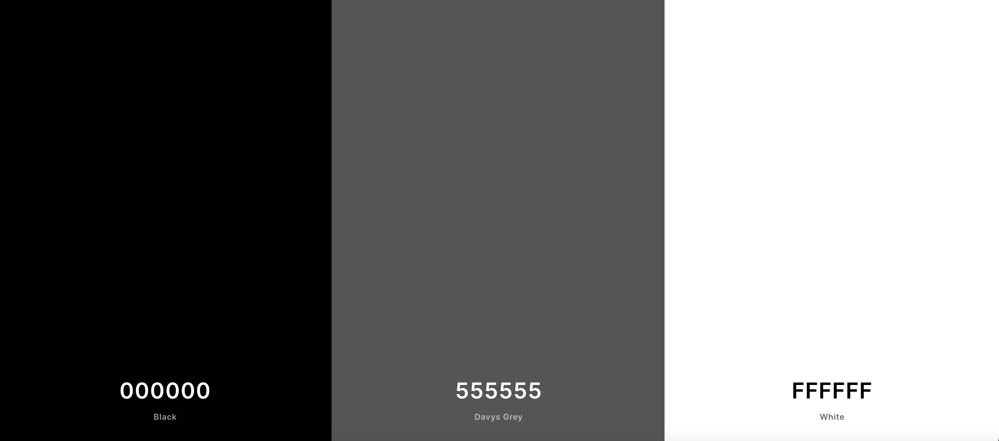

# 👟 KICKZ

**Code Institute - Full Stack Frameworks with Django Milestone Project**

A ecommerce store/website that combines front-end and back-end frameworks. Developed to provide high-quality footwear (trainers) and accessories, predominantly aimed at the Menswear fashion market.

Designed to be responsive and accessible on a range of devices, making it easy to navigate for potential users/customers. Creating an easy and informative based site. Whist striving for a minimalist and user-friendly design, to encourage a positive UX.

To test the website's checkout functionality, use the following payment credentials below:

- **Card number:** 4242 4242 4242 4242
- **Expiry date:** Any future date
- **CVC:** Any 3 digits
- **ZIP:** 42424

## Demo
A live demo can be found [here](https://flask-task-wizard.herokuapp.com/).

<h2 align="center"></h2>

## Table of Contents

- <a href="#ux">User Experience</a>
- <a href="#features">Features</a>
- <a href="#information-architecture">Information Architecture</a>
- <a href="#technologies">Technologies Used</a>
- <a href="#testing">Testing</a>
- <a href="#deployment">Deployment</a>
- <a href="#credits">Credits</a>

## User Experience (UX)

-   ### User stories

    -   ### Visitor Goals

        1. As a user, I want to easily understand the main purpose of the site and learn more about the functionality of the website.
        2. As a user, I want to be able to easily navigate throughout the site, to find and enage in content.
        3. As a user, I want to be able to register or/and log in and access personal user profile/accounts relevant to the user. To enable them access to their own specified tasks, with the ability to create, read, update and delete functions.
	
    -   ### Design
    -   #### Colour Scheme
        -   The three main colours used are dim gray, yellow orange and persimmon. Keeping the colour scheme simple, yet effective.
	

    -   #### Typography
        -   I opted to use the default Materialize font Roboto 2.0, due to it’s clean font style, which fitted in with the aesthetic I wanted for the website.
    -   #### Imagery
        -   Due to the simplicity of the design and functionality of the website, I chose not to include imagery within the UX. However there could be further scope to include this in a future edition.

*   ### Wireframes

    -   Desktop Wireframes - [View](https://github.com/anronuay/MS3-task_wizard/blob/master/wireframes/bw-desktop.wireframe-home:tasks.page.png)
    
    -   Tablet Wireframes - [View](https://github.com/anronuay/MS3-task_wizard/blob/master/wireframes/bw-tablet.wireframe-home:tasks.page.png)
    			
    -   Mobile Wireframes - [View](https://github.com/anronuay/MS3-task_wizard/blob/master/wireframes/bw-smartphone.wireframe-home:tasks:register:login:profile.page.png)
    
*   ### Database Schema  

## Features

### Existing Features

-   Responsive on all device sizes.
-   Interactive elements.
-   Register a profile/account, Log In & Log Out functionality.
-   Create, Read, Update and Delete functionality, within the website database.
-   All users can create entries, after the register/log in process.
-   Admin only privileges, to manage categories section/page.
-   Users can only edit and/or delete their own entries.

### Future Features

-   Admin user, to include additional formatting that includes the Admin user privileges to edit all tasks. Not just their own.
-   Marks tasks completed, instead of deleting it from the database/website. A history of previously completed tasks on the user's profile.
-   Apply some defensive programming, to confirm if user wants to delete an action/task or not. To prevent accidental deleted entries.

### 

## Technologies Used

### Languages Used

-   [HTML5](https://en.wikipedia.org/wiki/HTML5)
-   [CSS3](https://en.wikipedia.org/wiki/Cascading_Style_Sheets)
-   [JavaScript](https://en.wikipedia.org/wiki/JavaScript)
-   [Python](https://en.wikipedia.org/wiki/Python_(programming_language))

### Frameworks, Libraries & Programs Used

1. [Materialize 1.0.0:](https://materializecss.com/getting-started.html)
    - Materialize was used to assist with the responsiveness and styling of the website.
1. [Font Awesome:](https://fontawesome.com/)
    - Font Awesome was used throughout the website to add icons for aesthetic and UX purposes.
1. [jQuery:](https://jquery.com/)
    - jQuery - JavaScript library.
1. [Flask:](https://flask.palletsprojects.com/en/1.1.x/)
    - Flask is a micro web framework written in Python.
1. [MongoDB:](https://www.mongodb.com/)
    - MongoDB is a cross-platform document-oriented database program. 
1. [Jinja:](https://jinja.palletsprojects.com/en/2.11.x/)
    - Jinja is a modern and designer-friendly templating language for Python, modelled after Django’s templates.
1. [PyMongo:](https://pypi.org/project/pymongo/)
    - PyMongo is a Python distribution containing tools for working with MongoDB, and is the recommended way to work with MongoDB from Python.
1. [Werkzeug:](https://pypi.org/project/Werkzeug/)
    - Werkzeug is a comprehensive WSGI web application library.
1. [Heroku:](https://www.heroku.com/)
    - Heroku is a cloud platform as a service supporting several programming languages. 
1. [Git](https://git-scm.com/)
    - Git was used for version control by utilising the Gitpod terminal to commit to Git and Push to GitHub.
1. [GitHub:](https://github.com/)
    - GitHub is used to store the projects code after being pushed from Git.
1. [Balsamiq:](https://balsamiq.com/)
    - Balsamiq was used to create the [wireframes](https://github.com/anronuay/MS3-task_wizard/tree/master/wireframes) during the design process.
1. [WebAIM:](https://webaim.org/resources/contrastchecker/)
    - Contrast checker, relevant in terms of accessibility and UX design.
1. [Favicon.io:](https://favicon.io/)
    - Free shortcut icon, website icon, tab icon, URL icon, or bookmark icon, associated with a particular website or web page.
1. [Multi Device Website Mockup Generator:](https://techsini.com/multi-mockup/)
    - Multi device website mockup generator is a free online tool to test your responsive website on apple devices including Apple iMac, MacBook, iPad and iPhone.
1. [Coolors:](https://coolors.co/)
    - Generate or browse beautiful colour combinations for your designs.
1. [Lucidchart:](https://www.lucidchart.com/pages/)
    - Lucidchart is a web-based proprietary platform that allows users to collaborate on drawing, revising and sharing charts and diagrams.

## Testing

The W3C Markup Validator and W3C CSS Validator Services were used to validate every page of the project to ensure there were no syntax errors in the project. Along with JS Hint to ensure there were no linting issues with my JavaScript and PEP 8 compliant Python code.

-   [W3C Markup Validator](https://validator.w3.org/#validate_by_input) - Only errors received, were relating to the Jinja syntax.
-   [W3C CSS Validator](https://jigsaw.w3.org/css-validator/#validate_by_input) - [Results](https://github.com/anronuay/MS3-task_wizard/blob/master/static/images/w3c-css.validator.png)
-   [JS Hint Version 2.12.0](https://jshint.com/)
-   [PEP8 online](http://pep8online.com/) - [Results](https://github.com/anronuay/MS3-task_wizard/blob/master/static/images/pep8online.png)

### Testing User Stories from User Experience (UX) Section

-   #### User Stories

    1. As a user, I want to easily understand the main purpose of the site and learn more about the functionality of the website.

        1. Upon entering the site, users are automatically greeted with a clean and easily readable navbar, with the title 'Task Wizard' and the header 'All Tasks'. Underneath there is a small paragraph outlining the intention and various entries from other users with their relevant tasks below.
        2. All Tasks search bar and collapsible task list, when clicked on reveal additional information to the user. Prompting the user to either register or log in to gain additional access to the website.

    2. As a user, I want to be able to easily navigate throughout the site, to find and engage in content.

        1. The website was designed with the intention to be easy, simple to use and the content to be pretty self explanatory.
        2. Interactively via the task manager application, allowing additional access once user is registered and/or logged in.

    3. As a user, I want to be able to register or/and log in and access personal user profile/accounts relevant to the user. To enable them access to their own specified tasks, with the ability to create, read, update and delete function.

        1. CRUD functionality enabled for all registered/logged in users. Users can only edit and delete their own task entries.
        2. Only Admin user can manage categories section, with CRUD functionality.

### Further Testing

-   The Website was tested on Google Chrome, Internet Explorer, Microsoft Edge and Safari browsers.
-   The website was viewed on a variety of devices such as Desktop, Laptop, iPad, iPhone 5SE, iPhone7, iPhone 8, Samsung Galaxy S10 and all mobile device options provided by Google Chrome DevTools.
-   A large amount of testing was done to ensure that all pages were linking correctly.
-   Friends and family members were asked to review the site and documentation to point out any bugs and/or user experience issues.

### Manual Testing

Using the Materialize layout and mobile fist development method, it allowed me to create a responsive website. All of the content resizes appropriately within the size of the displayed screen. This was tested using Google Chrome DevTools, allowing me to use the responsive feature and set mobile devices, to resize the screen and see how the website responded to different device screen sizes. 

1. Home/All Tasks: [View](https://github.com/anronuay/MS3-task_wizard/blob/master/static/images/website-screenshots/website.screenshot-alltasks.png)
    1. Search bar enables the user to search through task list, using key words.
    2. Drop down task list, once clicked on, includes additional information about the task.
    3. Includes, task category, task name, task description, due date, user name and if the task is or is not urgent.
    4. Once the user is either logged in or registered, allows the user to either/or edit and delete their own tasks.
    5. Navbar allows the user to either/or log in and register to their profile/account.
    6. Flash messages to allow user responsive feedback from action.
    7. No console errors detected.
    
2. Log In/Register: [View: Log In](https://github.com/anronuay/MS3-task_wizard/blob/master/static/images/website-screenshots/website.screenshot-login.png) [View: Register](https://github.com/anronuay/MS3-task_wizard/blob/master/static/images/website-screenshots/website.screenshot-register.png) [View: Username already exists](https://github.com/anronuay/MS3-task_wizard/blob/master/static/images/website-screenshots/website.screenshot-username.png)
    1. Prompt for user to enter, username and password, to log in and/or register.
    2. Both fields will except characters from 5 to 15 in length, including combinations of either/or letters and numbers.
    3. The user must meet these requirements or a prompt will instruct them to match the correct format.
    4. Additional link provided below, to either register or log in, or vice versa, to allow the user ease of navigation.
    5. Flash messages to allow user responsive feedback from action.
    6. No console errors detected.
    
3. Profile: [View: Admin Profile](https://github.com/anronuay/MS3-task_wizard/blob/master/static/images/website-screenshots/website.screenshot-adminprofile.png) [View: Standard Profile](https://github.com/anronuay/MS3-task_wizard/blob/master/static/images/website-screenshots/website.screenshot-profile.png)
    1. Simple card tile, indicating the user profile logged in.
    2. Navbar allows the user ease of navigation around the website.
    3. Home, Profile, New Task, Manage Categories (Admin user only) and Log Out functions.
    4. Flash messages to allow user responsive feedback from action.
    5. No console errors detected.
    
4. Add/Edit Task: [View: Add Task](https://github.com/anronuay/MS3-task_wizard/blob/master/static/images/website-screenshots/website.screenshot-addtask.png) [View: Edit Task](https://github.com/anronuay/MS3-task_wizard/blob/master/static/images/website-screenshots/website.screenshot-edittask.png)
    1. Form with the following compulsory fields required.
    2. Task Category (from drop down list), Task Name, Task Description, Due Date and toggle to mark if the task is or is not urgent.
    3. Navbar allows the user ease of navigation around the website.
    4. Home, Profile, New Task, Manage Categories (Admin user only) and Log Out functions.
    5. Flash messages to allow user responsive feedback from action.
    6. No console errors detected.
  
5. Admin/Categories: [View: Manage Categories](https://github.com/anronuay/MS3-task_wizard/blob/master/static/images/website-screenshots/website.screenshot-managecategories.png) [View: Add Categories](https://github.com/anronuay/MS3-task_wizard/blob/master/static/images/website-screenshots/website.screenshot-addcategories.png) [View: Edit Categories](https://github.com/anronuay/MS3-task_wizard/blob/master/static/images/website-screenshots/website.screenshot-editcategories.png)
    1. Only Admin user has privileges to access and maintain the categories section of the website.
    2. A list formatted with simple card tiles, of the different task categories (listed alphabetically).
    3. Additional functionality, to allow Admin to either/or add, edit and delete task categories.
    4. Edit Category enables Admin to edit category name. Or to cancel, to revert back to original text.
    5. Navbar allows the user ease of navigation around the website.
    6. Home, Profile, New Task, Manage Categories (Admin user only) and Log Out functions.
    7. Flash messages to allow user responsive feedback from action.
    8. No console errors detected.
    
6. Log Out: [View](https://github.com/anronuay/MS3-task_wizard/blob/master/static/images/website-screenshots/website.screenshot-logout.png)
    1. Log In page.
    2. Flash messages to allow user responsive feedback from action.
    3. Navbar allows the user ease of navigation around the website.
    4. Home, Log In and Register functions.
    6. No console errors detected.
    
### Known Bugs

- On small mobile devices, Home/All Tasks and Admin Edit Category pages. The buttons seem to stack each other and lose their positioning, this also effects the search tasks box. Creating a more cluttered look to the UX. Given more time, this would be something I would rectify, to keep within the design aesthetic for the rest of the website.

- Currently only one Admin user, has privileges to the Manage Categories section of the website. This can be problematic further down the line, when/if the website requires more maintenance and would need to be reassessed to allow for multiple Admin users to connect.

- MongoDB, storing the Object ID as the primary key for the collection, due to it being a unique identifier. However, within this website/scenario, we have to assume both the Username & Category Name are not changeable and unique. As this can potentially run into errors, due to them being (VARCHAR) string variants.

## Deployment

### Heroku

This project uses **Heroku** for deployment. 

In order to successfully deploy the app, the following steps were taken:

- Visit GitPod workspace.
- Create the Flask App.
- Use the CLI to tell Heroku which applications and dependencies are required to run the application via the, `pip3 freeze --local > requirements.txt` command.
- Create the Procfile via `echo web: python app.py > Procfile`.
- Visit [Heroku](https://www.heroku.com/).
- Click, 'Create a New App'.
- Create an application on Heroku with a unique name **('flask-task-wizard')** to satisfy Heroku requirements.
- Create the Heroku application.
- Add the following configuration vars to Heroku application:
    - `IP`
    - `PORT`
    - `MONGO_URI`
    - `SECRET_KEY`
    - `MONGO_DBNAME`
- Visit workspace/IDE.
- Push newly created `requirements.txt` and `Procfile` to Git.
- Navigate back to Heroku and enable automatic deployment.
- Connect Heroku to deploy from the **master** branch of Task Wizard's repository.
- Successfully deploy the application.

## Local Machine

To run the project from your local machine, follow these steps:

- Make sure git is installed `git --version`.
- If Git isn't already configured, configure Git:
    - `git config --global user.name "your_username"`
    - `git config --global user.email "your_email_address@example.com"`
- Check the configuration:
    - `git config --global --list`

- **Clone** the application in your local environment via command:

    - `gh repo clone anronuay/MS3-task_wizard`

## Credits

### Code

-   [W3Schools:](https://www.w3schools.com/) Online web tutorials used throughout, reinforcing my knowledge acquired through the course.
-   [Materialize 1.0.0:](https://materializecss.com/getting-started.html) A modern responsive front-end framework based on Material Design.
-   [Mike Dane:](https://www.youtube.com/channel/UCvmINlrza7JHB1zkIOuXEbw) YouTube Python & MongoDB Tutorials.
-   [freeCodeCamp.org:](https://youtu.be/Z1RJmh_OqeA) YouTube 'Learn Flask for Python - Full Tutorial'.
-   [Stack Overflow:](https://stackoverflow.com/) Public platform is used by nearly everyone who codes, to learn, share their knowledge and collaborate.
-   [Code Institute:](https://courses.codeinstitute.net/courses/course-v1:CodeInstitute+DCP101+2017_T3/course/) Reference from Code Institute's Data Centric Development module & Task Manager Mini Project.

### Content

-   All content was written by the developer, unless stated otherwise.

### Acknowledgements

-   Code Institute's Tutor support team, my Mentor and the Slack community.

**This is for educational use.**